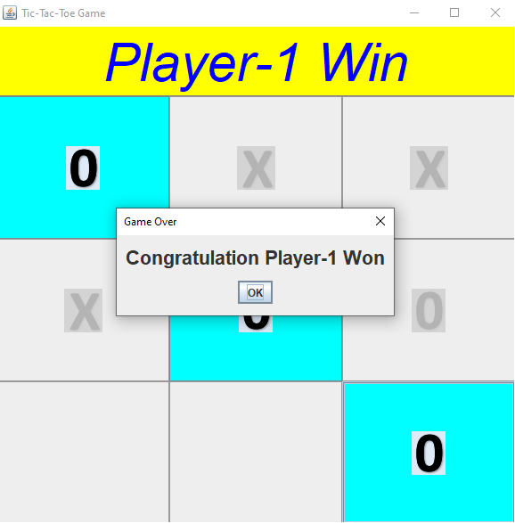
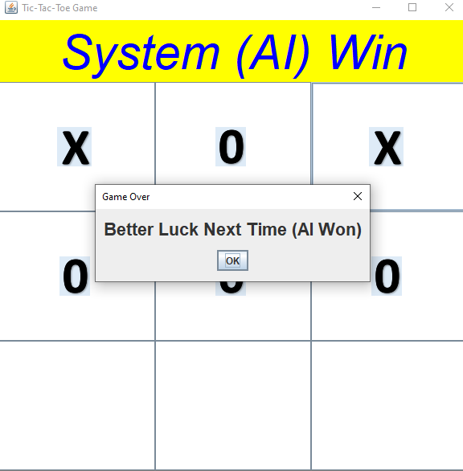
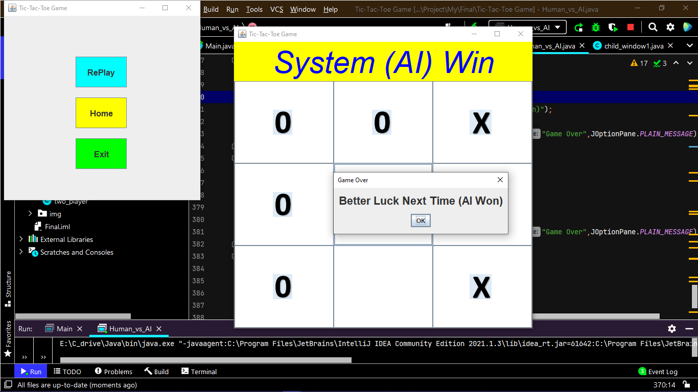
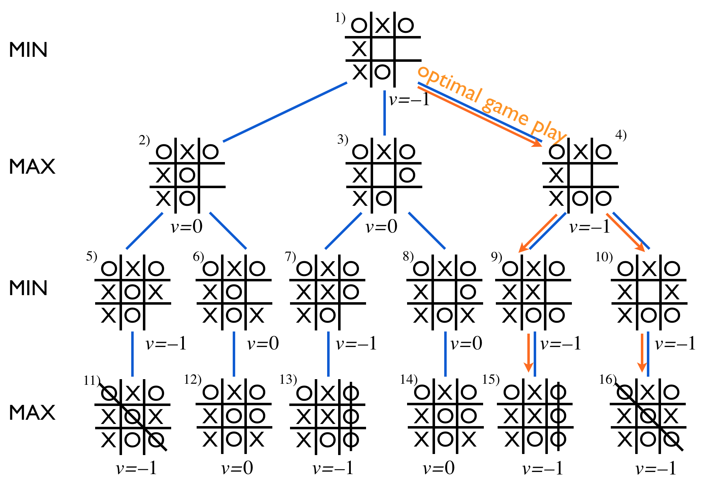
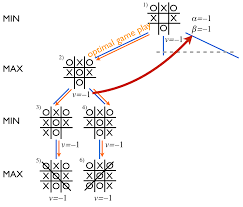

# Tic-Tac-Toe-Game-Simple-AI-Game-Algorithm
Using Simple Tic-Tac-Toe Logical Algorithm And Using Min-Max Algorithm

</img></img>

## Simple Tic-Tac-Toe Logical Algorithm

Two Player Play Game then 
Player - 1
Player - 2

## Using Min-Max Algorithm

One Player with AI (System) Play Game

</img>

### Using minmax algorithm

Minimax is a decision rule used in artificial intelligence, decision theory, game theory, statistics, and philosophy for minimizing the possible loss for a worst case (maximum loss) scenario. 

When dealing with gains, it is referred to as "maximin"—to maximize the minimum gain. Originally formulated for n-player zero-sum game theory, covering both the cases where players take alternate moves and those where they make simultaneous moves, it has also been extended to more complex games and to general decision-making in the presence of uncertainty.

</img>

</img>

## Reference material Link 

- https://materiaalit.github.io/intro-to-ai/part2/

- https://www.geeksforgeeks.org/minimax-algorithm-in-game-theory-set-3-tic-tac-toe-ai-finding-optimal-move/
